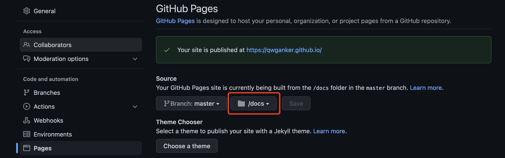

## 安装hugo
```
brew install hugo
```

## 初始化一个项目
```
hugo new site [name]
```

## 下载主题

```
touch .gitmodules
cd themes/
git submodule add  https://github.com/olOwOlo/hugo-theme-even
```

拷贝 even 主题的配置文件到根目录
```
cp themes/hugo-theme-even/exampleSite/config.toml ./
```


## 生成文章
```
hugo new post/xxx.md
```


##  生成静态文件
-d 指定生成到 docs 文件件
```
hugo -d docs
```

## 发布到 github pages
需要设置 docs 为发布的静态文件为目录

